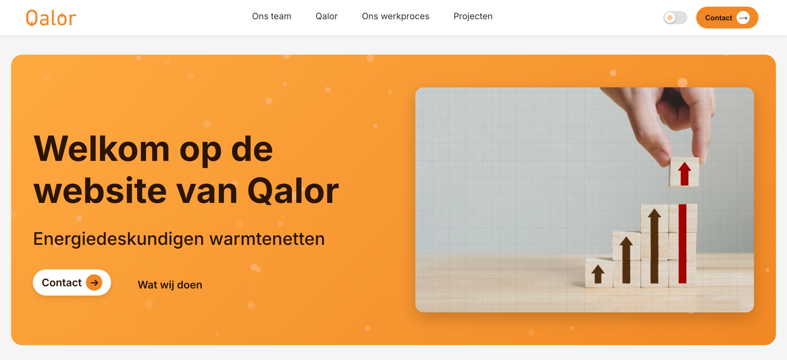
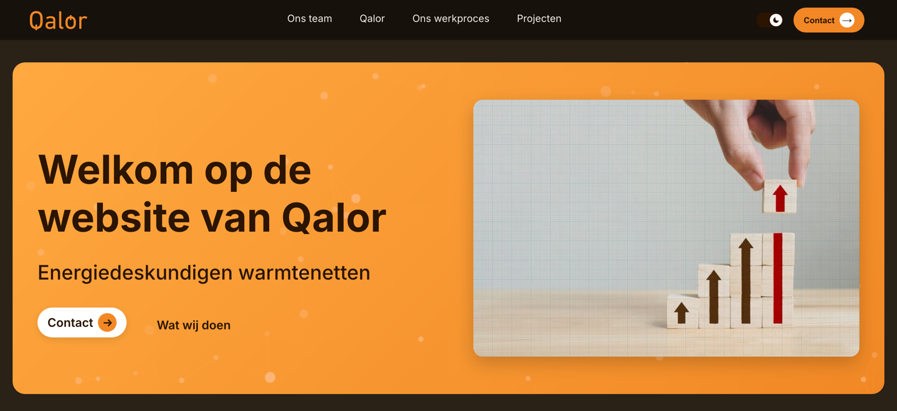
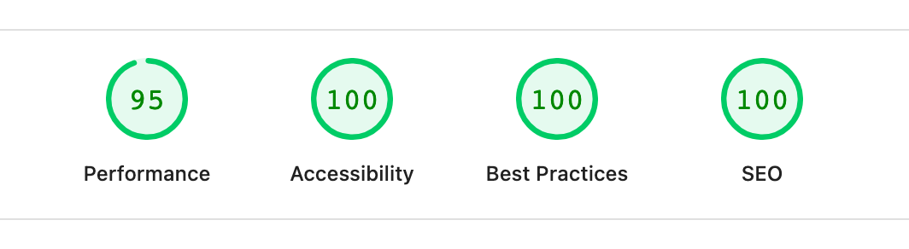
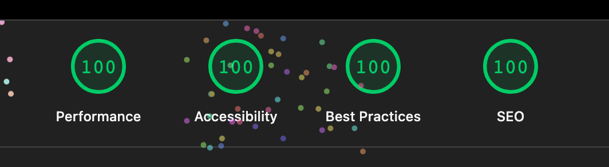

# Qalor Website

[](https://github.com/Artoriun/qalor-website-preview/actions/workflows/ci.yml)

The marketing site for Qalor — energy experts specialising in heating networks and sustainable
energy solutions. Prerendered to static HTML so the first response is real content, with every
section editable from an admin portal.

**Live:** https://qalor.nl · **Preview:** https://artoriun.github.io/qalor-website-preview/





---

## Lighthouse

Measured against the production build. CI runs the same audit on every push and gates
accessibility, best practices and SEO at 100.

<br>
**Mobile** — LCP 2.6s · CLS 0 · TBT 0ms

<br>
**Desktop** — LCP 0.6s · CLS 0.002 · TBT 0ms

---

## Stack

| | |
| --- | --- |
| **Front end** | React, TypeScript, Vite |
| **Back end** | Express, Firestore |
| **Media** | Cloudinary |
| **Tooling** | TurboRepo, Biome, Playwright, Lighthouse |
| **Hosting** | FTP (production) · GitHub Pages (preview) |

---

## Quick start

```bash
npm install
npm run dev      # web + API
```

The admin portal at `/admin` works out of the box with local placeholders — no Firestore or
Cloudinary account needed to try it. See [ADMIN.md](ADMIN.md) for the full setup.

### Scripts

```bash
npm run build            # production build
npm run prerender        # capture each route's DOM into its own index.html
npm run ci               # everything CI runs, in order
npm run test             # API and unit tests
npm run test:e2e         # Playwright layout and accessibility sweep
npm run check:budgets    # gzipped payload budget
npm run check:lighthouse # accessibility / SEO / best-practices gate
npm run hash-password    # prints an ADMIN_PASSWORD_HASH
```

---

## Features

- **Single-page marketing site** — Hero, Team, About, Werkproces, Projecten and Footer, all
  anchor-scrolled from the nav
- **Every section is admin-editable** at `/admin` — copy, images, team members and projects
  change without a redeploy
- **SEO landing pages** at `/warmtenet-tekening/`, `/warmtenet-ontwerp/`,
  `/warmtenetberekening/` and `/warmtenet-business-case/`, one per search intent, each with
  its own copy, title, canonical and `Service` schema. See [SEO.md](SEO.md)
- **WCAG AA dark mode** from the header, set by a blocking inline script before first paint so
  there is no flash of the wrong theme. Light is the standard first visit regardless of the OS
  setting
- **Shared carousel** for Team and Projecten — auto-advancing, drag and swipe, infinite wrap,
  pause button, arrow-key navigation and a `prefers-reduced-motion` opt-out
- **Team CVs** open in a modal rendered by the browser's own PDF viewer, no library
- **Images** from Cloudinary, requested at the size they are displayed and served as WebP

---

## Adding or replacing an image

The two directions need opposite things from `ASSET_VERSION` in
`packages/shared/src/index.ts`.

**Adding** one: upload it under a public ID nothing has used, then reference it *without* a
version — `optimizeUrl` adds `ASSET_VERSION` itself. Leave that constant alone. A path nothing
has fetched has nothing cached against it, so bumping only re-downloads every other image.

**Replacing** one: overwrite the public ID in Cloudinary with `invalidate` on, then bump
`ASSET_VERSION`. The delivery URLs carry that version, and without a change to it the path is
identical before and after — browsers keep serving what they already hold for the full year
these assets are cached for.

---

## Testing

`npm run ci` runs the pipeline in CI's order: Biome, `tsc`, API and unit tests, a Playwright
layout and accessibility sweep, the suite again against the built output and its subpath
variant, a gzipped bundle budget, and Lighthouse.

---

## Deployment

Production deploys by FTP from `master`, and only after every check passes. The GitHub Pages
preview above is built from `main` with a base path and a `noindex`.

**Node 22** is required (`.nvmrc`).

---

## Licence

All rights reserved — see [LICENSE](LICENSE). The source is published to be read, not reused:
this is client work, and the copy, photographs and brand assets belong to Qalor.
